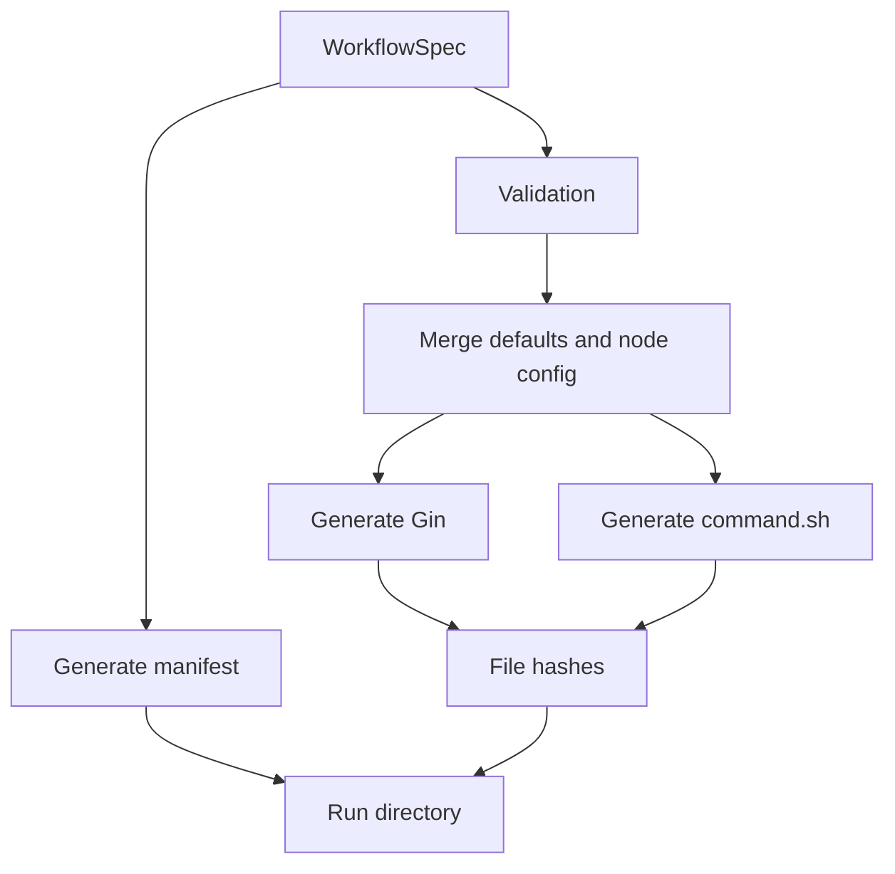

# Reproducibility Model

Reproducibility in `rl-flow` centers on compiled artifacts, not only source configs. The key question is: can a researcher explain exactly what ran after the run directory exists?

## Compilation Boundary

## Manifest Contents

The run manifest records:

- run ID and experiment ID
- sweep ID, group ID, trial ID, and seed when available
- created timestamp
- paths for workflow, resolved config, Gin file, and command
- SHA-256 hashes for generated files
- git commit and dirty state
- Python version
- platform string
- dependency versions for core runtime packages
- backend

## Current Guarantees

- Compilation validates before writing run commands.
- Generated Gin output is deterministic where ordering matters.
- Local and SLURM execution consume the same generated command.
- Sweep summaries group seed replicates by non-seed hyperparameters.
- Analysis can rebase sweep manifests when moved with their sweep directory.

## Current Limits

- Dependency capture is a selected package list, not a complete lockfile snapshot.
- Git dirty state is recorded, but dirty diff content is not preserved.
- Dataset and artifact metadata are not fully typed.
- Job recovery after process restart is limited.
- There is no formal result-card or benchmark registry yet.

## Research Checklist

Before reporting a result, preserve:

- source commit and dirty-state note
- workflow and sweep YAML
- run or sweep manifest
- generated command and Gin file
- metric definition and aggregation window
- seed list and seed count
- analysis config and exported curves
- environment and backend details
