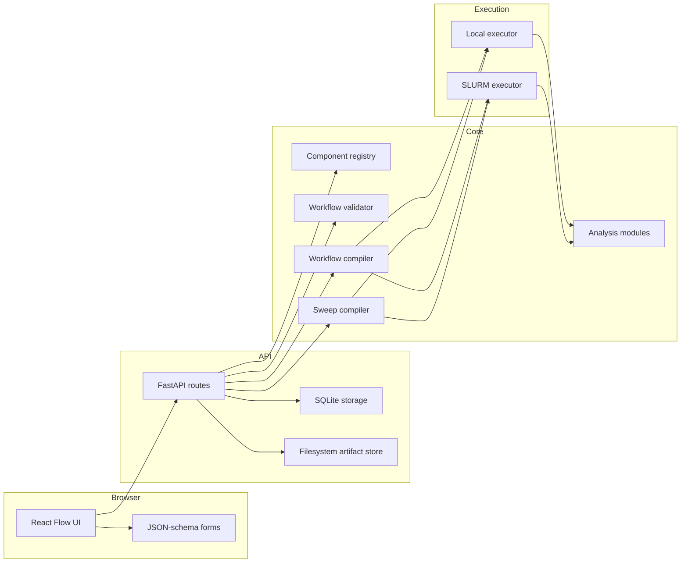
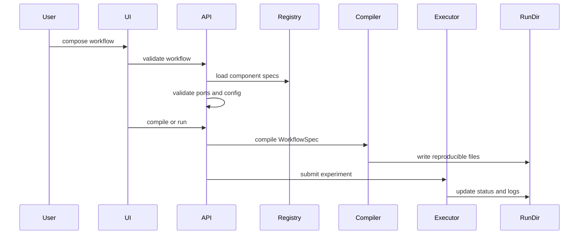

# System Architecture

`rl-flow` separates interaction, validation, compilation, execution, and analysis.

## Packages

`packages/core/rlflow`
: schemas, registry, graph validation, compiler, sweep compiler, execution backends, storage, tracking, analysis, CLI.

`packages/builtin_components/rlflow_builtin`
: builtin environments, tabular algorithms, DQN/R-Max training code, intrinsic rewards, replay buffers, and runner modules.

`apps/api/rlflow_api`
: FastAPI service over the core package.

`apps/web`
: Vite React app with React Flow, TanStack Query, Zustand, and schema-rendered forms.

## Workflow Lifecycle

## Design Boundary

The frontend owns interaction state. The Python backend owns RL semantics. This boundary is the right default for a research framework because it lets algorithm authors add components without frontend work, while still giving users a visual composition layer.
