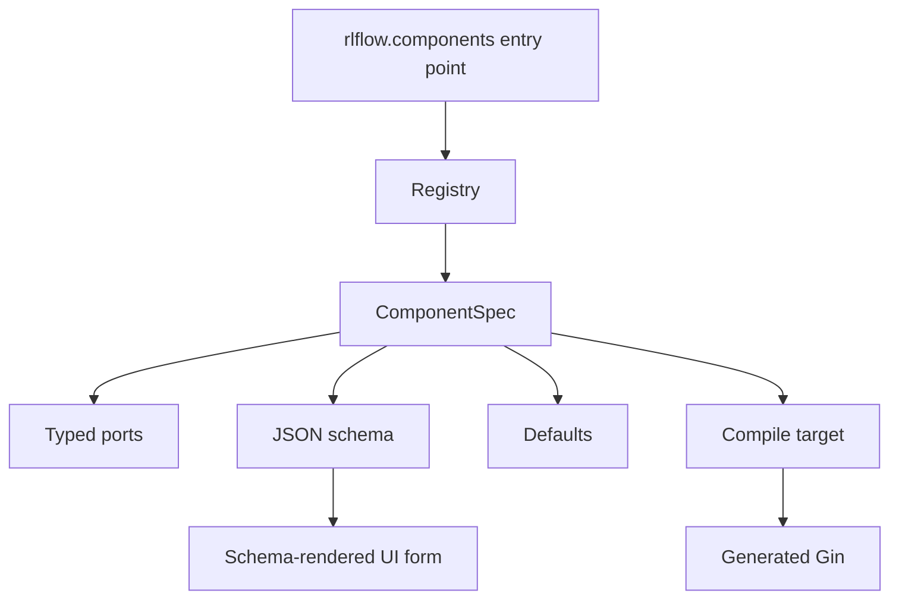

# Components

Components are the public extension unit of `rl-flow`. A component should describe enough structure for validation, compilation, and UI rendering without custom frontend code.

## Anatomy



Important fields:

- `id`: globally unique component ID, usually namespaced by provider.
- `source`: provider group, such as `builtin` or `navix`.
- `version`: component spec version.
- `kind`: role in the workflow graph.
- `input_ports` and `output_ports`: typed compatibility contract.
- `config_schema`: JSON schema for validation and UI forms.
- `defaults`: baseline config.
- `compile_target`: bindings or command module used by compilation.

## Authoring Pattern

Expose third-party components through the `rlflow.components` entry point:

```toml
[project.entry-points."rlflow.components"]
my_components = "my_package.components:components"
```

Return `ComponentSpec` objects:

```python
from rlflow.schemas.component import ComponentSpec, PortSpec


def components():
    return [
        ComponentSpec(
            id="my.logger",
            source="my_package",
            kind="logger",
            display_name="My Logger",
            output_ports=[PortSpec(name="logger", type="logger")],
            config_schema={
                "type": "object",
                "additionalProperties": False,
                "properties": {"enabled": {"type": "boolean"}},
            },
            defaults={"enabled": True},
            compile_target={"gin": {"bindings": {"MyLogger.enabled": "enabled"}}},
        )
    ]
```

## Research Framework Guidance

For research-grade plugins, include component versions, clear port descriptions, JSON schema descriptions for every parameter, stable defaults, and example workflows. The framework should eventually enforce compatibility metadata so old workflows can be reconstructed against old component versions.
