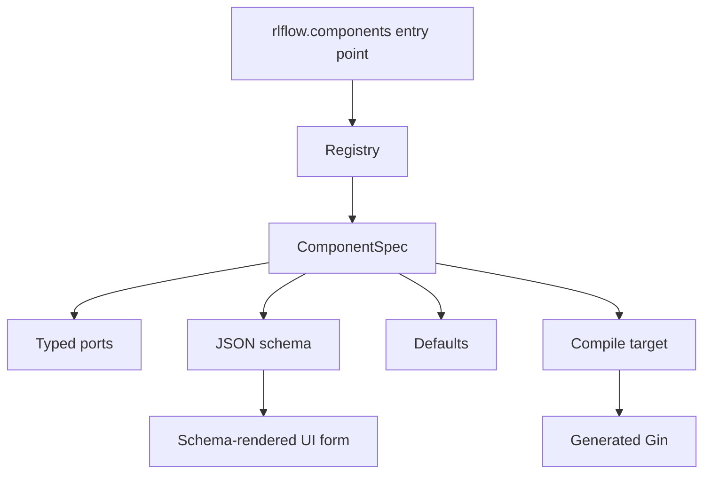

# Components

Components are the public extension unit of `rl-flow`. A component should describe enough structure for validation, compilation, and UI rendering without custom frontend code.

## Anatomy


```mermaid
flowchart TB
    spec[ComponentSpec]
    spec --> ports[Typed ports]
    spec --> schema[JSON schema]
    spec --> defaults[Defaults]
    spec --> target[Compile target]
    registry[Registry] --> spec
    entry[rlflow.components entry point] --> registry
    schema --> ui[Schema-rendered UI form]
    target --> gin[Generated Gin]
```

Important fields:

- `id`: globally unique component ID, usually namespaced by provider.
- `source`: provider group, such as `builtin` or `navix`.
- `version`: component spec version.
- `kind`: role in the workflow graph.
- `input_ports` and `output_ports`: typed compatibility contract.
- `config_schema`: JSON schema for validation and UI forms.
- `defaults`: baseline config.
- `compile_target`: bindings or command module used by compilation.

## Authoring Pattern

Expose third-party components through the `rlflow.components` entry point:

```toml
[project.entry-points."rlflow.components"]
my_components = "my_package.components:components"
```

Return `ComponentSpec` objects:

```python
from rlflow.schemas.component import ComponentSpec, PortSpec


def components():
    return [
        ComponentSpec(
            id="my.logger",
            source="my_package",
            kind="logger",
            display_name="My Logger",
            output_ports=[PortSpec(name="logger", type="logger")],
            config_schema={
                "type": "object",
                "additionalProperties": False,
                "properties": {"enabled": {"type": "boolean"}},
            },
            defaults={"enabled": True},
            compile_target={"gin": {"bindings": {"MyLogger.enabled": "enabled"}}},
        )
    ]
```

## Making Compute Components Executable

The entry point above makes a component *visible* — it renders in the UI and
passes validation. Compute components (agents, intrinsic-reward modules) also
need to *execute*. The builtin runner (`builtin.runner.tabular_jax`) dispatches
to third-party agents through a runtime hook declared on the spec:

```python
ComponentSpec(
    id="my.agent.sarsa_lambda",
    kind="agent",
    display_name="SARSA(lambda)",
    output_ports=[PortSpec(name="agent", type="agent")],
    config_schema={...},
    compile_target={"runtime": {"entry_point": "my_package.training:run_training"}},
)
```

When a workflow's agent node resolves to a component the runner does not handle
natively, it imports `my_package.training` and calls:

```python
def run_training(*, workflow: WorkflowSpec, resolved: dict, run_dir: Path) -> None:
    ...
```

The callable owns the run: train however you like (reuse `rlflow_builtin`
environments if helpful) and write the standard outputs into `run_dir` —
`logs/train_history.jsonl` rows with `episode` / `env_step` / `return` (and
ideally `discounted_return`), plus `summaries/metrics.json` — so sweeps,
`rlflow report`, and the UI work unchanged. The package must be installed in the
environment the compiled `command.sh` runs in; the runner performs entry-point
discovery at startup.

A complete worked example lives at `tests/fixtures/external_agent/example_agent.py`,
exercised end-to-end (validate → compile → execute → report) by
`tests/integration/test_external_component.py`.

## Research Framework Guidance

For research-grade plugins, include component versions, clear port descriptions, JSON schema descriptions for every parameter, stable defaults, and example workflows. The framework should eventually enforce compatibility metadata so old workflows can be reconstructed against old component versions.
