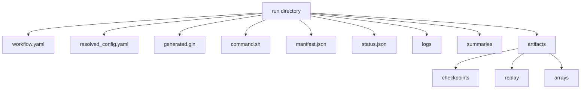

# Run Directories

The run directory is the reproducibility boundary. If a run succeeds or fails, this directory should explain what happened.

## Core Files

`workflow.yaml`
: Original workflow spec written by the compiler.

`resolved_config.yaml`
: Component defaults merged with node overrides.

`generated.gin`
: Deterministic Gin config generated from compile targets.

`command.sh`
: Executable command that marks status, runs the selected runner, and records success or failure.

`manifest.json`
: Run provenance: file hashes, git state, dependency versions, platform, backend, seed, and sweep metadata.

`status.json`
: Filesystem-visible lifecycle state.

## Output Folders

`logs/`
: Train and eval JSONL histories plus executor logs.

`summaries/`
: Scalar metrics and exported summary tables.

`artifacts/checkpoints/`
: Optional checkpoints.

`artifacts/replay/`
: Optional replay datasets.

`artifacts/arrays/`
: Optional arrays such as Q-tables and action counts.

## Research Practice

Copy the whole run directory when preserving a result. Do not copy only plots. The manifest and generated command are needed to reconstruct the execution conditions.
