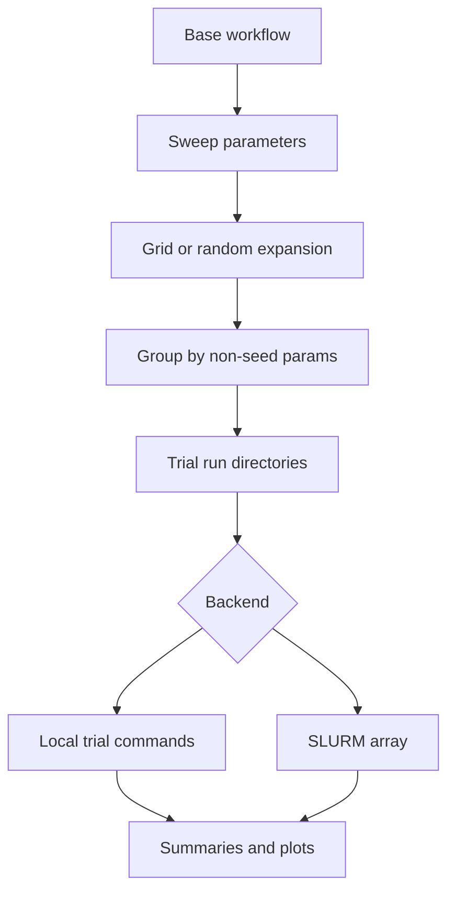

# Sweeps

Sweeps expand one base workflow into many trial workflows. A trial can differ by learning rate, seed, replay size, optimizer settings, intrinsic-reward settings, or any other config path under `nodes.<node_id>.config`.



## Parameter Targets

Targets use node IDs:

```yaml
parameters:
  learning_rate:
    target: nodes.agent-1.config.learning_rate
    values: [0.00003, 0.0001, 0.0003]
```

Seed parameters are recognized by name, such as `seed`, `runner_seed`, or a target ending in `.seed`. Seed values are grouped separately from non-seed hyperparameters.

## Methods

`grid`
: Expands every combination of listed values.

`random`
: Samples from `choice`, `uniform`, `loguniform`, and `int_uniform` distributions.

For random sweeps, `num_trials` counts sampled non-seed hyperparameter
assignments. Seed parameters with explicit `values` are expanded as replicates
for every sampled assignment, so `num_trials: 100` and `seed.values: [0, 1, 2]`
compile to 300 trials grouped into 100 non-seed configurations.

## Metrics

Sweep summaries can read metrics from `summaries/metrics.json` or derive training-history metrics such as:

- `mean_train_return`
- `mean_train_return_last_n`
- `mean_train_discounted_return`
- `mean_train_discounted_return_last_n`
- `mean_train_return_last_50`
- `mean_train_discounted_return_last_50`

## Seed Grouping

Each group is one non-seed hyperparameter assignment. The summary reports mean, min, max, standard deviation, seed count, trial IDs, and run directories. This is the right unit for ranking algorithm settings.
