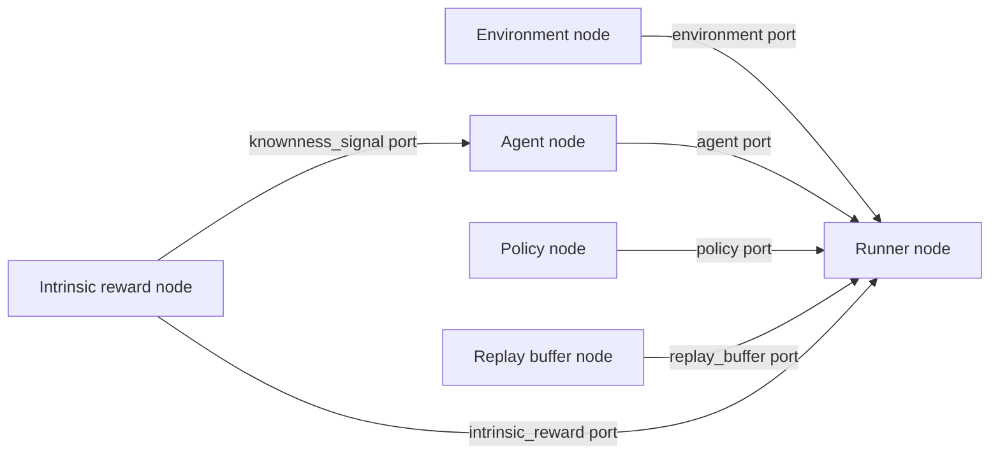

# Workflows

A workflow is a typed experiment graph. It is represented by `WorkflowSpec` and contains nodes, edges, execution settings, and metadata.



## Nodes

Each node has:

- `id`: stable identifier used by edges and sweep targets.
- `component`: registered component ID.
- `config`: node-specific overrides.
- `position`: UI coordinates.

## Edges

Each edge connects a source output port to a target input port:

```yaml
from_node: agent
from_port: agent
to_node: runner
to_port: agent
```

Validation checks that both nodes exist, both ports exist, and port types match.

## Execution

Execution is part of the workflow:

```yaml
execution:
  backend: local
  cluster: null
  options: {}
```

Supported backends are `local` and `slurm`.

## Metadata

Metadata carries run and sweep information such as `experiment_id`, `sweep_id`, `sweep_group_id`, `sweep_trial_id`, and `seed`. The compiler copies this into the run manifest.
