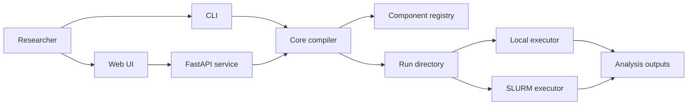

# rl-flow Documentation

`rl-flow` is a schema-driven workflow framework for reinforcement learning research. It lets you compose experiments as graphs, validate them against Python component specs, compile them into reproducible run directories, and execute them locally or on SLURM.

The core idea is that research semantics live in Python while the UI and API stay schema-driven. A component declares its ports, JSON schema, defaults, and compile targets. The workflow graph connects those components. The compiler writes the concrete run artifacts that make an experiment inspectable after it has finished.



## What This Site Covers

- How to run the built-in RiverSwim, Navix DQN, and DQN + R-Max examples.
- How workflows, components, runners, sweeps, run manifests, artifacts, and datasets fit together.
- How to launch seed-grouped hyperparameter sweeps and analyze learning curves.
- How to extend the component registry without editing the React UI.
- Where the current architecture is strong, where it is still prototype-grade, and what needs to change to become a proper research framework.

## Fastest Path

Install the project with development and analysis dependencies:

```bash
uv sync --extra dev --extra docs
```

Validate and run the smallest built-in research example:

```bash
uv run rlflow workflow validate configs/workflows/tabular_q_learning_riverswim.yaml
uv run rlflow run configs/workflows/tabular_q_learning_riverswim.yaml --backend local
```

Build the documentation site:

```bash
uv run python scripts/generate_docs_reference.py
uv run mkdocs build --strict
```

## Research Priorities

The current framework is best understood as a reproducible experiment compiler with a schema-driven UI, a built-in set of tabular and JAX DQN components, and sweep-analysis tooling. The next level is not just more algorithms. It is stronger experiment provenance, benchmark metadata, plugin compatibility, artifact browsing, result cards, and robust job orchestration.
